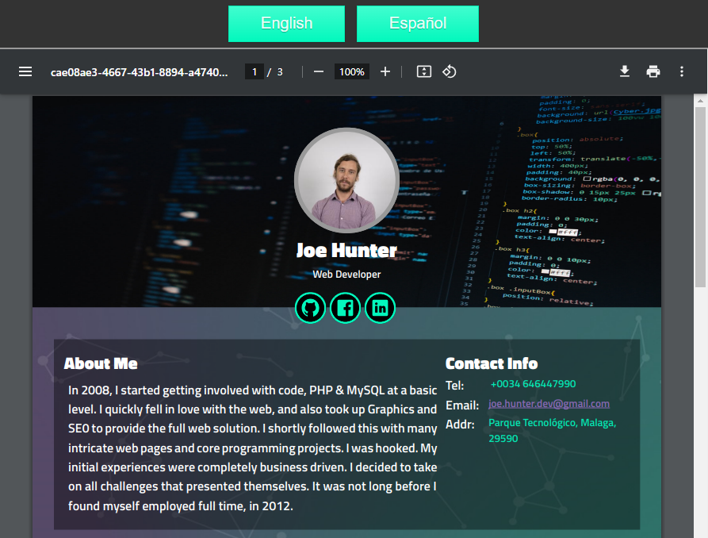

# 📄 React PDF CV Generator

A react-based PDF generator that allows users to easily create and customize PDF documents using React components. 
Good if you're looking to code and want a quick start to react-pdf. I've scraped [my website using](https://joehunter.es) a html first approach as it best suits my needs
but of course could be hooked into your CMS or repurposed. 

## 🚀 Features
- 📝 Template
    - 🌅 Page background
    - 🧩 Various reusable components
- 🖋️ Custom fonts
- 🌐 Multi-language support
- 🎨 SVG
- 📊 Data Feed from API

## 🏁 Getting Started

To get started, simply clone the repository and run `npm install` to install the necessary dependencies. Then, run `npm run dev` to start the development server.

## 💡 Usage

- See curriculum-en.json for example data
- Customize and style your components to suit your needs

## 📑 Additional 
- api.php or cv.json will help you generate the data structure it consumes
- [React PDF](https://react-pdf.org)

